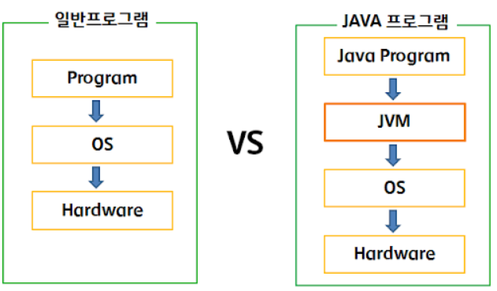
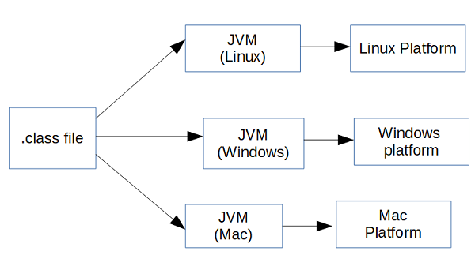

JVM은 Java Virtual Machine의 약어로 자바를 실행하기 위한 가상 컴퓨터라고 할 수있다. 가상 기계는 소프트웨어로 구현된 하드웨어를 뜻하는 넒은 의미의 용어이며 컴퓨터의 성능이 향상됨에 따라 점점 더 많은 하드웨어들이 소프트웨어화되어 컴퓨터 속으로 들어가고 있다.  
요약해 JVM은 컴퓨터 속의 컴퓨터라고 생각하면 된다. 자바로 작성된 애플리케이션은 모두 JVM에서만 실행되기 때문에, 자바 애플리케이션이 실행되기 위해서는 반드시 JVM이 필요하다. 그렇다면 JVM은 어디서 어떻게 작동하는 것일까? 함께 알아보자.

* * *

## JVM 특징
일반 애플리케이션의 코드는 OS만 거치고 하드웨어로 전달되는데 비해 Java애플리케이션은 JVM을 한번 더 거치기 때문에, 그리고 하드웨어에 맞게 완전히 컴파일된 상태가 아니고 실행 시에 해석되기 때문에 속도가 느리다는 단점을 가지고 있다. 그러나 요즘엔 바이트 코드(컴파일된 자바코드)를 하드웨어의 기계어로 바로 변환해주는 JIT컴파일러와 향상된 최적화 기술이 적용되어 속도의 격차를 많이 줄였다.

일반프로그램과 자바프로그램 실행 프로세스 비교

위 이미지를 보면 일반 프로그램은 OS와 바로 맞붙어 있기 때문에 OS종속적이다. 때문에 다른 OS에서 실행시키기 위해서는 애플리케이션을 그 OS에 맞게 변경해주어야한다. 반면 자바 프로그램은 JVM하고만 상호작용을 하기 때문에 OS와 하드웨어에 독립적이라 다른 OS에서도 프로그램 변경없이 실행이 가능한 것이다. 단, JVM은 OS에 종속적이여서 해당 OS에서 실행가능한 JVM이 필요하다.

JVM은 각각의 OS에 맞는 버전이 필요하다.

* * *

## 바이트 코드
JVM과 중요시 되는 요소는 바이트 코드이다. 바이트 코드는 JVM에서만 실행되는 기계어로서, 어떤 CUP와도 관계없는 코드이다.  
자바 컴파일러는 자바 소스 프로그램을 컴파일하여 바이트 코드로 된 클래스 파일을 생성한다. 이 클래스 파일은 컴퓨터의 CPU에 의해 직접 실행되지 않고, JVM이 인터프리터 방식으로 실행시킨다. 이 클래스 파일은 어떤 OS를 탑재하든 CPU의 종류가 무엇이든, 어떤 하드웨어든 상관없이 JVM만 있으면 바로 실행 가능하며, 실행시 JVM의 JIT컴파일러에 의해 바이너리 코드로 변환되어 프로그램을 실행시킨다.  

__알아두기__  
- 바이너리 코드
    >이진코드라고도 하며, 컴퓨터가 인식할 수 있는 0과 1로 구성되어 있다.  
- 기계어
    >0과 1로 이루어진 바이너리 코드이며, 모든 이진코드가 기계어인 컷은 아니다. 또한 기계어는 특정한 언어가 아니라 CPU가 이해하는 명령어 집합으로, CPU 제조사마다 기계어가 다를 수 있다.

* * *

읽어주셔서 감사합니다. 😊